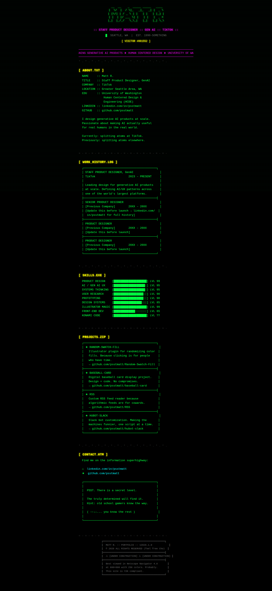
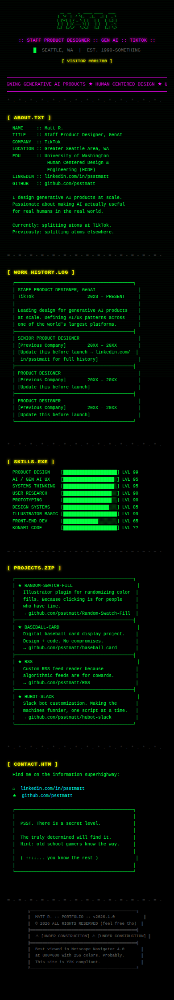
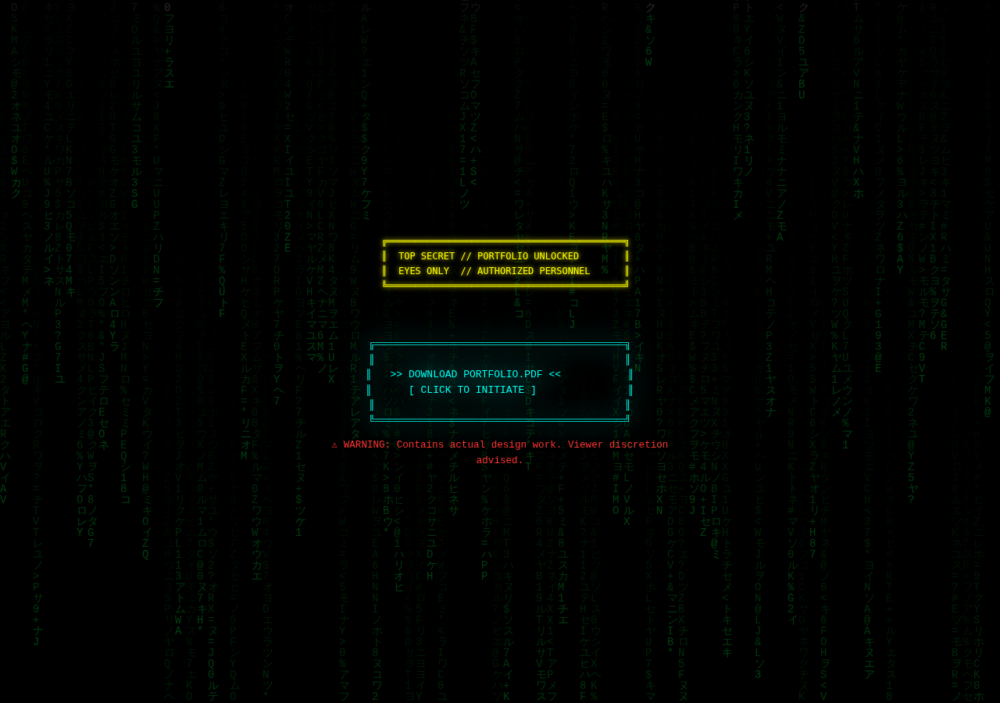

# MATT R. — STAFF PRODUCT DESIGNER PORTFOLIO

> Geocities reborn. Mobile-first. ASCII art. Zero frameworks.

A single-page portfolio for Matt R. (Staff Product Designer, GenAI @ TikTok) built in the spirit of early-web aesthetics — preformatted text, box-drawing characters, neon-on-black, CRT scanlines, and a healthy disrespect for minimalism.

---

## Screenshots

### Desktop



### Mobile



### Konami Code Easter Egg

Hit `↑ ↑ ↓ ↓ ← → ← → B A` anywhere on the page.



---

## Features

- **ASCII art name banner** with neon glow and blinking cursor
- **Scrolling marquee** (CSS animation, no `<marquee>` tag)
- **CRT scanline overlay** via repeating CSS gradient
- **Sections:** About · Work History · Skills (progress bars) · Projects · Contact
- **Fake visitor counter** — because 1997 called
- **Konami code easter egg** (`↑↑↓↓←→←→BA`):
  - Full-screen matrix rain (canvas)
  - ASCII rocket launches with color-cycling cheat text
  - PDF portfolio download offer
  - Post-download contact card + confirmation
- **Mobile-first** — single-column layout scales from 320px up

---

## Stack

| Thing | Choice |
|---|---|
| HTML | Semantic HTML5, no framework |
| CSS | Custom properties, `@keyframes`, mobile-first |
| JS | Vanilla ES5-safe script, canvas matrix rain |
| Build tools | None |
| Dependencies | None |

---

## File Structure

```
2026-portfolio/
├── index.html          # All content + Konami overlay markup
├── style.css           # Retro theme, animations, layout
├── script.js           # Konami detection + easter egg logic
├── portfolio.pdf       # ← REPLACE with your actual PDF
└── screenshots/
    ├── desktop.png
    ├── mobile.png
    └── konami-easter-egg.png
```

---

## Before Launch — Checklist

- [ ] **Work history** — update placeholder rows in `index.html`  
  Search for `[Previous Company]` and fill in real roles/dates/descriptions

- [ ] **Contact info** — update the Konami phase-3 contact card  
  Search for `[your@email.com]` and `[+1-555-000-0000]`

- [ ] **Portfolio PDF** — replace `portfolio.pdf` with your actual file  
  Keep the filename the same or update the `href` in `script.js`

- [ ] **Deploy** — drop the four files anywhere static hosting works  
  (GitHub Pages, Netlify, Vercel, or even a zip on Dropbox — it's 1997)

---

## Local Development

No build step. Just open `index.html` in a browser, or run any static server:

```bash
# Python
python3 -m http.server 8000

# Node (if http-server is installed globally)
npx http-server .
```

Then navigate to `http://localhost:8000`.

---

## Easter Egg

The Konami code (`↑↑↓↓←→←→BA`) works on any keyboard-accessible device. After activation:

1. Matrix rain fires, ASCII rocket launches, cheat text flashes
2. A download button pulses into view — click it to grab `portfolio.pdf`
3. A contact card appears with email, phone, and LinkedIn
4. Press `ESC` or the close button to return to the site

---

*Best viewed in Netscape Navigator 4.0 at 800×600 with 256 colors. This site is Y2K compliant.*
